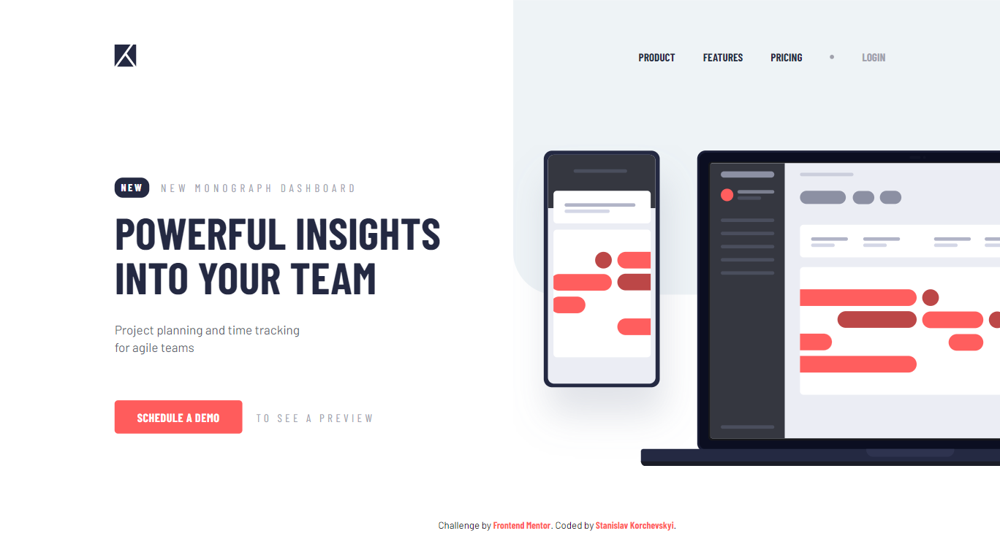

# Frontend Mentor - Project tracking intro component

## Welcome! 👋

This is my solution for the challenge from [Frontend Mentor](https://www.frontendmentor.io).

**The challenge was to build out the responsive page and got it looking as close to the design as possible using HTML, CSS and JS for navigation toggle.**

[Check out my solution](https://stanislavcodes.github.io/project-tracking-intro-component/)

## Preview of my solution!

## Design preview for the challenge

